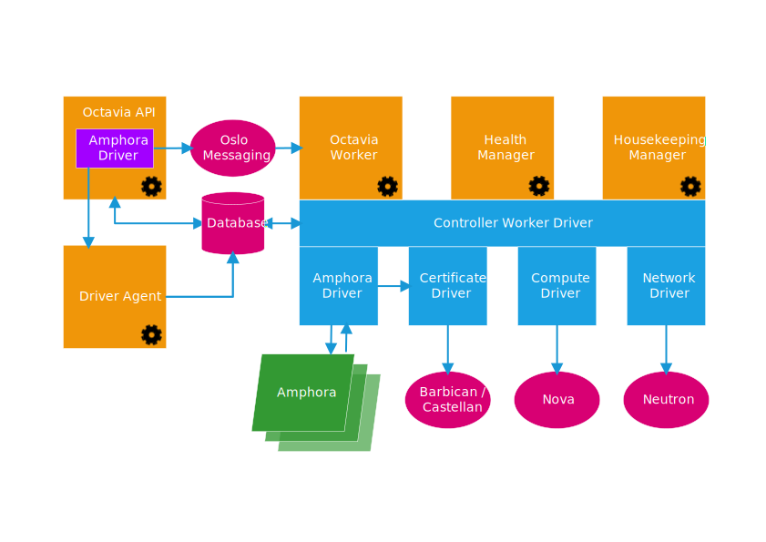

..
      Copyright (c) 2016 IBM

      Licensed under the Apache License, Version 2.0 (the "License"); you may
      not use this file except in compliance with the License. You may obtain
      a copy of the License at

          http://www.apache.org/licenses/LICENSE-2.0

      Unless required by applicable law or agreed to in writing, software
      distributed under the License is distributed on an "AS IS" BASIS, WITHOUT
      WARRANTIES OR CONDITIONS OF ANY KIND, either express or implied. See the
      License for the specific language governing permissions and limitations
      under the License.

===================
Introducing Octavia
===================
Welcome to Octavia!

Octavia is an open source, operator-scale load balancing solution designed to
work with OpenStack.

Octavia was born out of the Neutron LBaaS project.  Its conception influenced
the transformation of the Neutron LBaaS project, as Neutron LBaaS moved from
version 1 to version 2. Starting with the Liberty release of OpenStack, Octavia
has become the reference implementation for Neutron LBaaS version 2.

Octavia accomplishes its delivery of load balancing services by managing a
fleet of virtual machines, containers, or bare metal servers—collectively known
as *amphorae*\— which it spins up on demand. This on-demand, horizontal scaling
feature differentiates Octavia from other load balancing solutions, thereby
making Octavia truly suited "for the cloud."

Where Octavia fits into the OpenStack ecosystem
-----------------------------------------------
Load balancing is essential for enabling simple or automatic delivery scaling
and availability. In turn, application delivery scaling and availability must
be considered vital features of any cloud. Together, these facts imply that
load balancing is a vital feature of any cloud.

Therefore, we consider Octavia to be as essential as Nova, Neutron, Glance or
any other "core" project that enables the essential features of a modern
OpenStack cloud.

In accomplishing its role, Octavia makes use of other OpenStack projects:

* **Nova** - For managing amphora lifecycle and spinning up compute resources
  on demand.
* **Neutron** - For network connectivity between amphorae, tenant environments,
  and external networks.
* **Barbican** - For managing TLS certificates and credentials, when TLS
  session termination is configured on the amphorae.
* **Keystone** - For authentication against the Octavia API, and for Octavia to
  authenticate with other OpenStack projects.
* **Glance** - For storing the amphora virtual machine image.
* **Oslo** - For communication between Octavia controller components, making
  Octavia work within the standard OpenStack framework and review system, and
  project code structure.
* **Taskflow** - Is technically part of Oslo; however, Octavia makes
  extensive use of this job flow system when orchestrating back-end service
  configuration and management.

Octavia is designed to interact with the components listed previously. In each
case, we've taken care to define this interaction through a driver interface.
That way, external components can be swapped out with functionally-equivalent
replacements— without having to restructure major components of Octavia. For
example, if you use an SDN solution other than Neutron in your environment, it
should be possible for you to write an Octavia networking driver for your SDN
environment, which can be a drop-in replacement for the standard Neutron
networking driver in Octavia.

As of Pike, it is recommended to run Octavia as a standalone load balancing
solution. Neutron LBaaS is deprecated in the Queens release, and Octavia is its
replacement. Whenever possible, operators are **strongly** advised to migrate
to Octavia. For end-users, this transition should be relatively seamless,
because Octavia supports the Neutron LBaaS v2 API and it has a similar CLI
interface. Alternatively, if end-users cannot migrate on their side in the
forseable future, operators could enable the experimental Octavia proxy plugin
in Neutron LBaaS.

It is also possible to use Octavia as a Neutron LBaaS plugin, in the same way
as any other vendor. You can think of Octavia as an "open source vendor" for
Neutron LBaaS.

Octavia supports third-party vendor drivers just like Neutron LBaaS,
and fully replaces Neutron LBaaS as the load balancing solution for
OpenStack.

For further information on OpenStack Neutron LBaaS deprecation, please refer to
https://wiki.openstack.org/wiki/Neutron/LBaaS/Deprecation.

Octavia terminology
-------------------
Before you proceed further in this introduction, please note:

Experience shows that—within the subsegment of the IT industry that creates,
deploys, and uses load balancing devices or services— terminology is often used
inconsistently. To reduce confusion, the Octavia team has created a glossary of
terms as they are defined and used within the context of the Octavia project
and Neutron LBaaS version 2. This glossary is available here: :doc:`glossary`

If you are familiar with Neutron LBaaS version 1 terms and usage, it is
especially important for you to understand how the meanings of the terms "VIP,"
"load balancer," and "load balancing," have changed in Neutron LBaaS version 2.

Our use of these terms should remain consistent with the :doc:`glossary`
throughout Octavia's documentation, in discussions held by Octavia team members
on public mailing lists, in IRC channels, and at conferences. To avoid
misunderstandings, it's a good idea to familiarize yourself with these glossary
definitions.

A 10,000-foot overview of Octavia components
--------------------------------------------

Octavia version 4.0 consists of the following major components:

* **amphorae** - Amphorae are the individual virtual machines, containers, or
  bare metal servers that accomplish the delivery of load balancing services to
  tenant application environments. In Octavia version 0.8, the reference
  implementation of the amphorae image is an Ubuntu virtual machine running
  HAProxy.

* **controller** - The Controller is  the "brains" of Octavia. It consists of
  five sub-components, which are individual daemons. They can be run on
  separate back-end infrastructure if desired:

  * **API Controller** - As the name implies, this subcomponent runs Octavia's
    API. It takes API requests, performs simple sanitizing on them, and ships
    them off to the controller worker over the Oslo messaging bus.

  * **Controller Worker** - This subcomponent takes sanitized API commands from
    the API controller and performs the actions necessary to fulfill the API
    request.

  * **Health Manager** - This subcomponent monitors individual amphorae to
    ensure they are up and running, and otherwise healthy. It also handles
    failover events if amphorae fail unexpectedly.

  * **Housekeeping Manager** - This subcomponent cleans up stale (deleted)
    database records, manages the spares pool, and manages amphora certificate
    rotation.

  * **Driver Agent** - The driver agent receives status and statistics updates
    from provider drivers.

* **network** - Octavia cannot accomplish what it does without manipulating
  the network environment. Amphorae are spun up with a network interface on the
  "load balancer network," and they may also plug directly into tenant networks
  to reach back-end pool members, depending on how any given load balancing
  service is deployed by the tenant.

For a more complete description of Octavia's components, please see the
:doc:`../contributor/design/version0.5/component-design` document within this
documentation repository.
